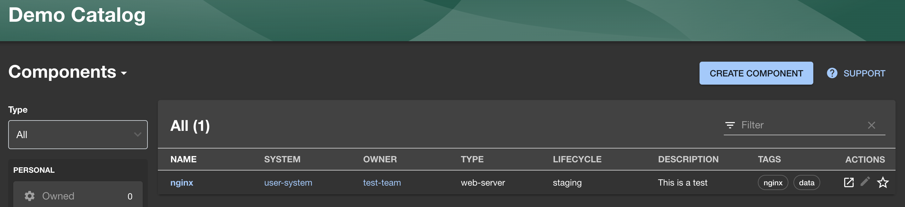

# peanut-backstage

HTTP API for dynamic Backstage resources from a K8s cluster.

This is **experimental** code.

## Example

There is an example Deployment in [example/deployment.yaml](example/deployment.yaml).

```yaml
apiVersion: apps/v1
kind: Deployment
metadata:
  name: nginx-deployment
  labels:
    app.kubernetes.io/component: web-server
    app.kubernetes.io/created-by: test-team
    app.kubernetes.io/instance: nginx-staging
    app.kubernetes.io/name: nginx
    app.kubernetes.io/part-of: user-system
    backstage.gitops.pro/lifecycle: staging
    backstage.io/kubernetes-id: user-system
  annotations:
    backstage.gitops.pro/description: This is a test
    backstage.gitops.pro/link-0: https://example.com/user,Example Users,user
    backstage.gitops.pro/link-1: https://example.com/group,Example Groups,group
    backstage.gitops.pro/tags: nginx,data
    testing.com/annotation: test-annotation
spec:
  replicas: 3
  selector:
    matchLabels:
      app.kubernetes.io/name: nginx
  template:
    metadata:
      labels:
        app.kubernetes.io/name: nginx
    spec:
      containers:
      - name: nginx
        image: nginx:1.14.2
        ports:
        - containerPort: 80
```

Deploy this to a cluster:

```console
$ kubectl create -f example/deployment.yaml
deployment.apps/nginx-deployment created
```

Run `peanut-backstage`:

```console
$ go run cmd/peanut-backstage/main.go serve
serving the root catalog at http://localhost:8080/backstage/catalog-info.yaml
```

You can test that it's working using curl

```console
$ curl -s http://localhost:8080/backstage/catalog-info.yaml | yq -r
apiVersion: backstage.io/v1alpha1
kind: Location
metadata:
  name: test-service
  description: just a test
spec:
  targets:
    - ./component/mysql/info.yaml
```

## Getting these into Backstage

To get this into your Backstage setup for a test:

Modify `app-config.yaml` (or `app-config.local.yaml` etc.) and add two parts.

(Assuming you're running this locally).

```yaml
backend:
  reading:
    allow:
    - host: localhost:8080
```

And add a location:

```yaml
catalog:
  locations:
  - type: url
    target: http://localhost:8080/backstage/catalog-info.yaml
```

Bring up your local Backstage environment:

```console
$ yarn dev
yarn run v1.22.19
<snip>
[1] 2022-06-29T05:50:33.835Z backstage info ::ffff:127.0.0.1 - - [29/Jun/2022:03:50:33 +0000] "GET /api/catalog/entities?offset=0&limit=500 HTTP/1.1" 200 - "-" "node-fetch/1.0 (+https://github.com/bitinn/node-fetch)" type=incomingRequest
[1] 2022-06-29T05:50:33.843Z search info Collating documents for software-catalog succeeded type=plugin
[0] <i> [webpack-dev-middleware] wait until bundle finished: /catalog?filters%5Bkind%5D=component&filters%5Buser%5D=all
[0] webpack compiled successfully
```

During the startup your browser will open at the catalog page:



## TODO

 * Validate required fields in Components
 * Extract more annotations to populate the Component e.g. dependsOn and
   providesApis
 * Is `app.kubernetes.io/part-of` a good way to determine `subcomponentof` ?
 * Extract more than just Components
 * Come up with a way to specify the root Location name, description
 * Caching of the data
 * **DOCUMENT** usage of labels!
